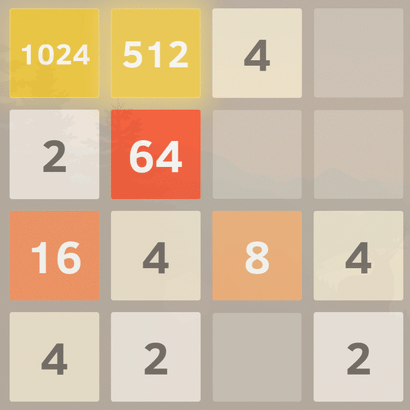

# Tensorflow Deep Reinforcement Learning

## Summary 
Tensorflow was used to build an intelligent agent capable of taking optimal actions for game 2048.

## What is 2048 

2048 is a web game concerned with matching equal tiles. All tiles hold values 2^n e.g 2,4,8,16...2048.

The game is extremely random and unpredictable.

## What is Tensorflow

## Why deep reinforcement learning?

## Initial agent

## Improved agent

## Potential reuse for code
