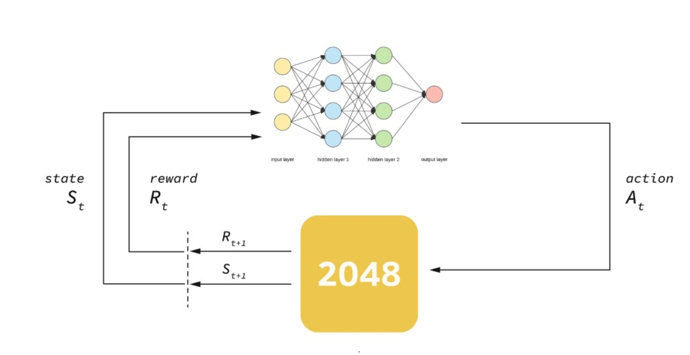
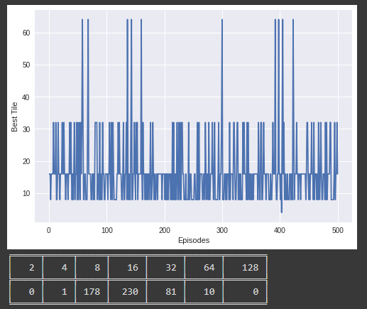
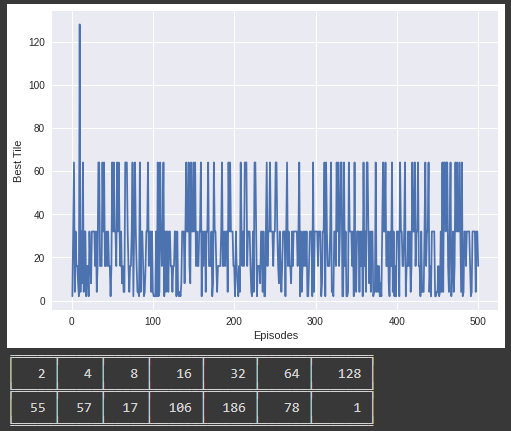

# Tensorflow Deep Reinforcement Learning

## Summary 
Tensorflow was used to build an intelligent agent capable of taking optimal actions for game 2048.

## What is 2048 

2048 is a web game concerned with matching equal tiles. All tiles hold values 2^n e.g 2,4,8,16...2048.

The game is extremely random and unpredictable.

## What is Tensorflow

A deep learning framework developed by Google, it is a powerful tool for building artificial intelligence systems.

## Why deep reinforcement learning?

Deep reinforcement learning is a powerful algorithm that combines reinforcement learning with deep learning. It solves problems using trial and error, learning how to make new moves through the power of a neural network. The algorithm is also general enough that it can be applied to different problem domains with little modification needed.

## Initial agent
The initial agent used the algorithm deep q reinforcement learning (DQN).

## Improved agent
The final agent used DQN but added the double, dueling and prioritised memory improvements. This allowed the agent to better learn to solve higher scores for the problem despite similar prior c

## Potential reuse for code
The code used for this project could be used to learn other games, take optimal decisions  in the stock market, recommend services to clients and many more!
